# Diagrama de Classes - IoT Vulnerability Detection Tool

## Visão Geral da Arquitetura

Este diagrama representa a estrutura de classes da ferramenta de detecção de vulnerabilidades IoT.

```mermaid
classDiagram
    direction TB

    %% ============================================
    %% CLASSE: InformationGathering
    %% ============================================
    class InformationGathering {
        -Dict~str,str~ env
        -Optional~str~ target
        -str vendor
        -Discover nd
        -PortScanner nm
        -bool has_web_interface
        -List~Dict~ web_services
        -List~Dict~ brute_force_services
        +__init__(target: Optional~str~)
        +network_discovery(ip_range: str) List~Dict~
        +nmap_scan() Dict
        +web_scan(output_dir: str) List~Dict~
    }

    %% ============================================
    %% CLASSE: TrafficAnalyzer
    %% ============================================
    class TrafficAnalyzer {
        -Dict~str,str~ env
        -Optional~str~ pcap_file
        -Optional~FileCapture~ cap
        -Dict~str,str~ _dns_cache
        -List~Dict~ security_findings
        +__init__(pcap_file: str)
        -_load_pcap()
        -_resolve_hostname(ip: str) str
        -_classify_file(filename: str) Optional~str~
        +capture_live(interface, output_file, ip_filter, output_dir)
        +list_endpoints() List~Dict~
        +list_destinations_ports() List~Dict~
        +protocol_hierarchy() List~Dict~
        +export_http_objects(output_folder: str) List~Dict~
        +extract_http_fields() List~Dict~
        +get_security_findings() List~Dict~
        +analyze(target: str, output_folder: str) Dict
    }

    %% ============================================
    %% CLASSE: VulnerabilityDetection
    %% ============================================
    class VulnerabilityDetection {
        -Dict~str,str~ env
        -str zap_api_key
        -str zap_host
        -int zap_port
        -Optional~Popen~ zap_process
        -Optional~ZAPv2~ zap
        -Dict~str,Any~ results
        +__init__()
        +start_zap(daemon: bool) bool
        -_wait_for_zap(timeout: int) bool
        -_initialize_zap_client()
        +spider_scan(target: str) List~str~
        +ajax_spider_scan(target: str, timeout_minutes: int) List~Dict~
        +active_scan(target: str, scan_policy: Optional~str~) List~Dict~
        +full_zap_scan(target: str) Dict
        +stop_zap()
        +extract_firmware(firmware_path: str, output_dir: Optional~str~) Optional~str~
        +analyze_firmware(extracted_path: str) Dict
        +brute_force_auth(target, service, users, cracked_credentials, vendor_credentials) List~Dict~
        -_test_vendor_credentials(target, service, credentials) List~Dict~
        -_test_cracked_credentials(target, service, credentials) List~Dict~
        +crack_hashes(hash_file: str) List~Dict~
        +lookup_cve(service, version, cpe_name) List~Dict~
        -_fetch_cves(base_url, params, headers) List~Dict~
        -_convert_cpe_to_23(cpe: str) Optional~str~
        +extract_db_info(db_path: str) Optional~Dict~
        -_get_web_url(target, web_service) str
        -_get_firmware_path(firmware_path, http_objects) Optional~str~
        +analyze(target, scan_results, output_dir, firmware_path, http_objects) Dict
    }

    %% ============================================
    %% CLASSE: ReportGenerator
    %% ============================================
    class ReportGenerator {
        -str output_dir
        -Dict~str,Any~ results
        -List~Dict~ vulnerabilities
        -str timestamp
        -str vendor
        -Dict~str,List~str~~ credentials_by_vendor
        +__init__(output_dir: str)
        +add_scan_results(module: str, results: Dict) None
        -_extract_vulnerabilities(module: str, results: Dict) None
        -_extract_from_nmap(results: Dict) None
        -_extract_from_traffic(results: Dict) None
        -_extract_from_vuln_detection(results: Dict) None
        -_map_zap_risk(risk: str) str
        -_map_cvss_severity(score: float) str
        +categorize_owasp_iot() Dict
        +calculate_severity() Dict
        -_get_recommendations(owasp_cat: str) List~str~
        +generate_json() str
        +generate_html() str
        +generate() Dict~str,str~
    }

    %% ============================================
    %% MÓDULO: utils
    %% ============================================
    class utils {
        <<module>>
        +List FIRMWARE_EXTENSIONS$
        +List CONFIG_EXTENSIONS$
        +List DB_EXTENSIONS$
        +List CREDENTIAL_EXTENSIONS$
        +List CREDENTIAL_PATTERNS$
        +List BRUTE_FORCE_SERVICES$
        +Dict MIME_MAP$
        +Dict OWASP_IOT_TOP10$
        +Dict VULN_TO_OWASP$
        +Dict ZAP_ALERT_TO_OWASP$
        +suppress_stderr() ContextManager
        +load_env() Dict~str,str~
        +parse_passwd_file(content: str) List~Dict~
        +parse_shadow_file(content: str) List~Dict~
        +search_patterns(path, patterns, extensions) List~Dict~
        +load_default_credentials(csv_path: str) Dict~str,List~str~~
        +get_credentials_for_vendor(credentials_by_vendor, vendor) List~str~
        +save_results(output_dir, prefix, name, data) str
    }

    %% ============================================
    %% MÓDULO: main (Orquestrador)
    %% ============================================
    class main {
        <<module>>
        +clear_screen()
        +print_banner()
        +select_target(hosts) str
        +confirm_action(message) bool
        +run_pipeline(target_ip, env) None
        +main() None
    }

    %% ============================================
    %% FERRAMENTAS EXTERNAS (Interfaces)
    %% ============================================
    class NmapScanner {
        <<external>>
        +PortScanner
        +scan()
    }

    class PysharkCapture {
        <<external>>
        +FileCapture
        +LiveCapture
    }

    class ZAPv2Client {
        <<external>>
        +spider
        +ajaxSpider
        +ascan
        +core
    }

    class ExternalTools {
        <<external>>
        +hydra
        +john
        +binwalk
        +whatweb
    }

    class NVD_API {
        <<external>>
        +REST API v2.0
        +CVE Lookup
    }

    %% ============================================
    %% RELACIONAMENTOS
    %% ============================================

    %% Dependências do main (orquestrador)
    main ..> InformationGathering : usa
    main ..> TrafficAnalyzer : usa
    main ..> VulnerabilityDetection : usa
    main ..> ReportGenerator : usa
    main ..> utils : usa

    %% Dependências com utils
    InformationGathering ..> utils : load_env, save_results
    TrafficAnalyzer ..> utils : load_env, save_results, MIME_MAP
    VulnerabilityDetection ..> utils : load_env, save_results, patterns, credentials
    ReportGenerator ..> utils : OWASP mappings, credentials

    %% Dependências com ferramentas externas
    InformationGathering --> NmapScanner : composição
    TrafficAnalyzer --> PysharkCapture : composição
    VulnerabilityDetection --> ZAPv2Client : composição
    VulnerabilityDetection ..> ExternalTools : usa
    VulnerabilityDetection ..> NVD_API : consulta

    %% Fluxo de dados entre classes
    InformationGathering ..> TrafficAnalyzer : scan_results
    InformationGathering ..> VulnerabilityDetection : scan_results, web_services
    TrafficAnalyzer ..> VulnerabilityDetection : http_objects, security_findings
    InformationGathering ..> ReportGenerator : add_scan_results
    TrafficAnalyzer ..> ReportGenerator : add_scan_results
    VulnerabilityDetection ..> ReportGenerator : add_scan_results
```

## Diagrama Simplificado de Fluxo

## Diagrama de Dependências Externas

## Tabela de Classes e Responsabilidades

| Classe | Arquivo | Responsabilidade Principal |
|--------|---------|---------------------------|
| **InformationGathering** | `information_gathering.py` | Descoberta de rede, escaneamento de portas e serviços |
| **TrafficAnalyzer** | `traffic_analyzer.py` | Captura de tráfego, análise de pacotes, extração de arquivos sensíveis |
| **VulnerabilityDetection** | `vulnerability_detection.py` | Escaneamento web (ZAP), análise de firmware, cracking, CVE lookup |
| **ReportGenerator** | `report_generator.py` | Agregação de vulnerabilidades, categorização OWASP, geração de relatórios |
| **utils** | `utils.py` | Configuração, constantes, funções utilitárias |
| **main** | `main.py` | Orquestração, interface do usuário, execução do pipeline |

## OWASP IoT Top 10 - Mapeamento de Detecção

| Categoria | Descrição | Detectado Por |
|-----------|-----------|---------------|
| **I1** | Weak/Hardcoded Passwords | VulnerabilityDetection (firmware, brute force) |
| **I2** | Insecure Network Services | InformationGathering (Nmap - Telnet, FTP) |
| **I3** | Insecure Ecosystem Interfaces | VulnerabilityDetection (ZAP scan) |
| **I4** | Lack of Secure Update | - |
| **I5** | Insecure Components | VulnerabilityDetection (CVE lookup) |
| **I6** | Insufficient Privacy | VulnerabilityDetection (ZAP - info disclosure) |
| **I7** | Insecure Data Transfer/Storage | TrafficAnalyzer (HTTP objects, credentials) |
| **I8** | Lack of Device Management | - |
| **I9** | Insecure Default Configuration | VulnerabilityDetection (default credentials) |
| **I10** | Lack of Physical Hardening | Fora do escopo |
